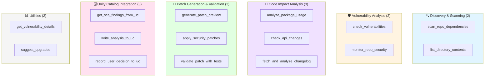
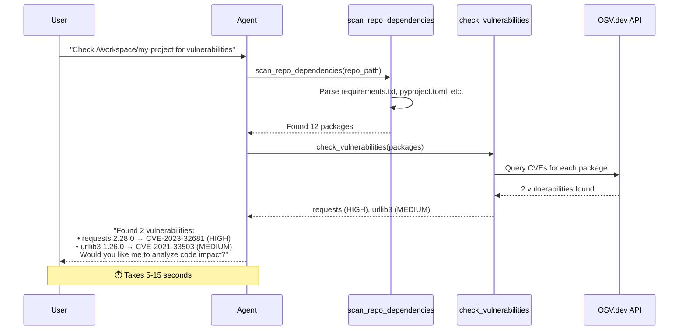
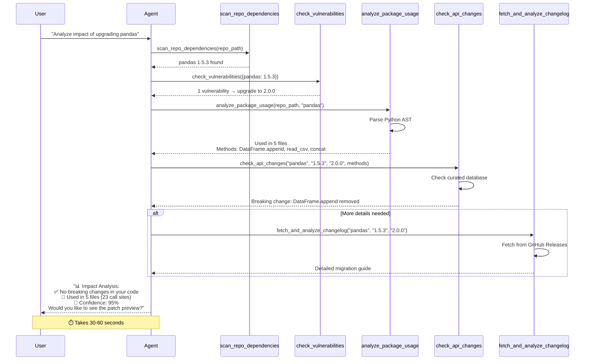
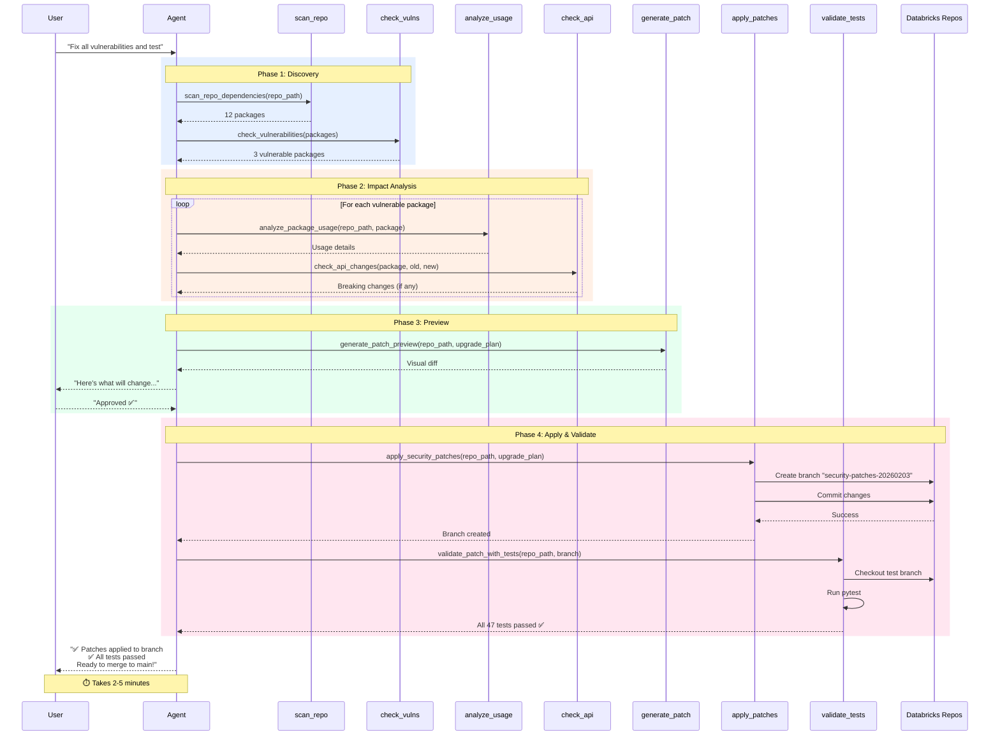
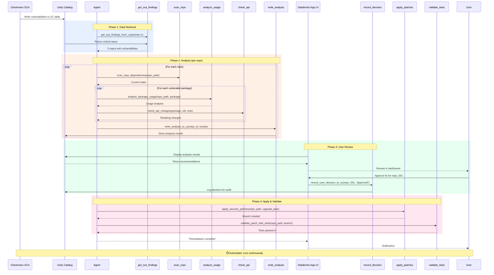
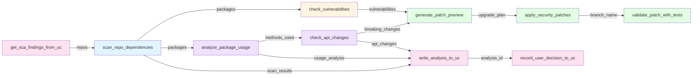
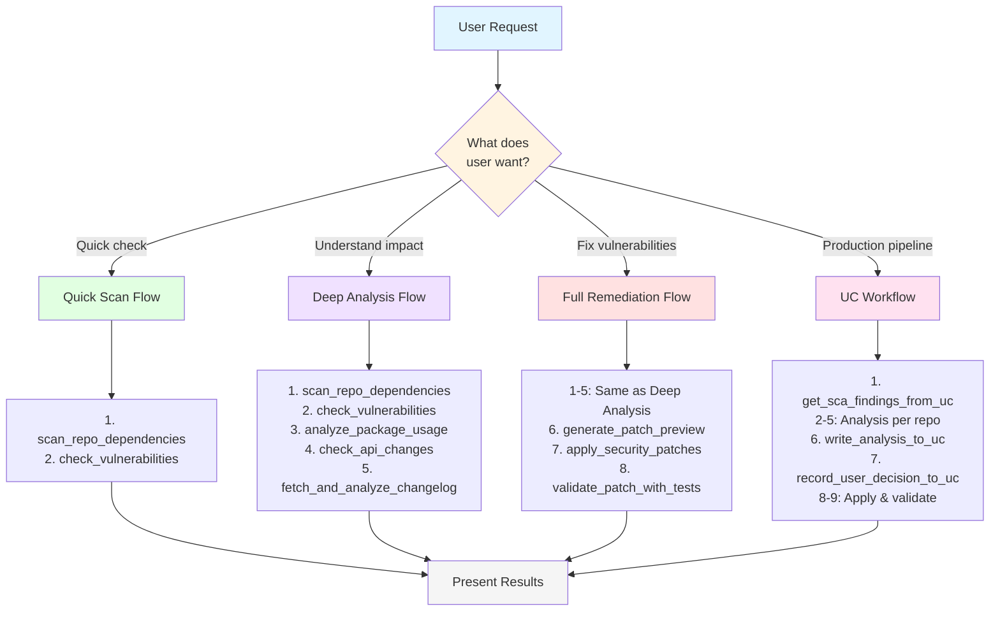
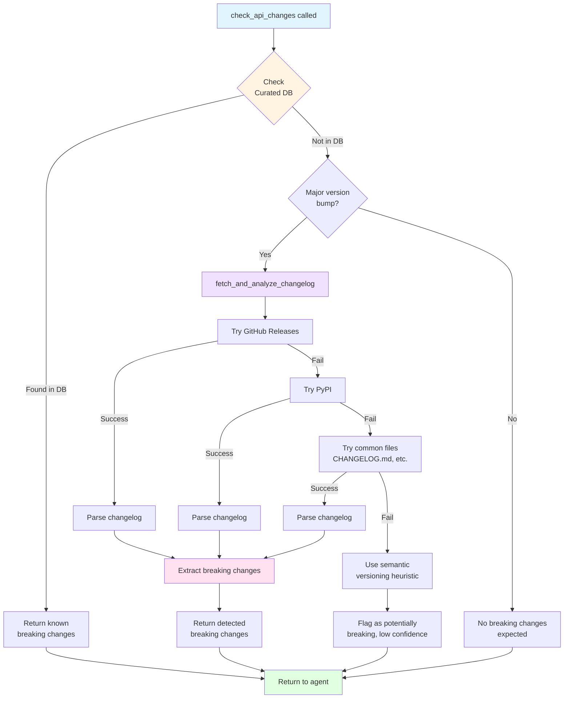
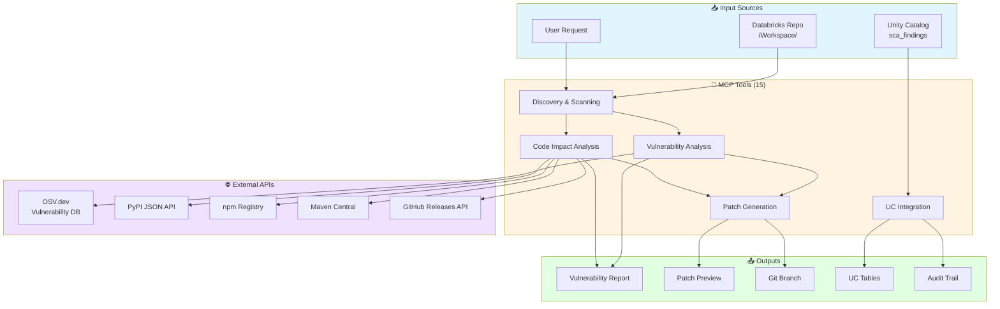

# 🔄 Tool Execution Flow Diagrams

Mermaid diagrams for presentations showing how the 15 MCP tools work together.

---

## 📊 Tool Organization (15 Tools)

---

## 1️⃣ Quick Security Scan (3-5 tool calls)

**Use case:** User wants a fast overview of vulnerabilities

---

## 2️⃣ Deep Analysis with Breaking Change Detection (6-10 tool calls)

**Use case:** User wants to understand upgrade impact before making changes

---

## 3️⃣ Full Remediation with Testing (10-15 tool calls)

**Use case:** User wants end-to-end vulnerability fixing with validation

---

## 4️⃣ Production UC Workflow (15+ tool calls)

**Use case:** Automated vulnerability scanning across multiple repositories

---

## 5️⃣ Tool Dependencies Map

Shows which tools depend on outputs from other tools:

---

## 6️⃣ Decision Tree: Which Tools to Use

---

## 7️⃣ Breaking Change Detection Strategy

---

## 8️⃣ Data Flow Architecture

---

## 🎨 Usage Tips for Presentations

### Rendering Mermaid Diagrams

**Option 1: Mermaid Live Editor**
- Go to https://mermaid.live/
- Paste any diagram code
- Export as PNG/SVG for slides

**Option 2: Markdown Renderers**
- GitHub automatically renders Mermaid
- VS Code with Mermaid extension
- Notion, Obsidian support Mermaid

**Option 3: PowerPoint/Keynote**
- Export diagrams as PNG from Mermaid Live
- Insert into slides

### Recommended Diagrams for Different Audiences

| Audience | Best Diagrams |
|----------|---------------|
| **Executives** | #1 (Tool Organization), #6 (Decision Tree) |
| **Developers** | #2 (Deep Analysis), #3 (Full Remediation), #7 (Breaking Change) |
| **DevOps/SRE** | #4 (UC Workflow), #8 (Data Flow) |
| **Security Teams** | #1 (Tool Organization), #4 (UC Workflow) |
| **Product Demos** | #2 (Deep Analysis), #3 (Full Remediation) |

### Color Coding

- 🔵 Blue (`#e1f5ff`): Discovery/Input
- 🟡 Yellow (`#fff4e1`): Analysis/Processing
- 🟣 Purple (`#f0e1ff`): Code Analysis
- 🟢 Green (`#e1ffe1`): Output/Success
- 🔴 Pink (`#ffe1f0`): Integration/Storage

---

**All diagrams are ready to use in your slides!** 📊✨

